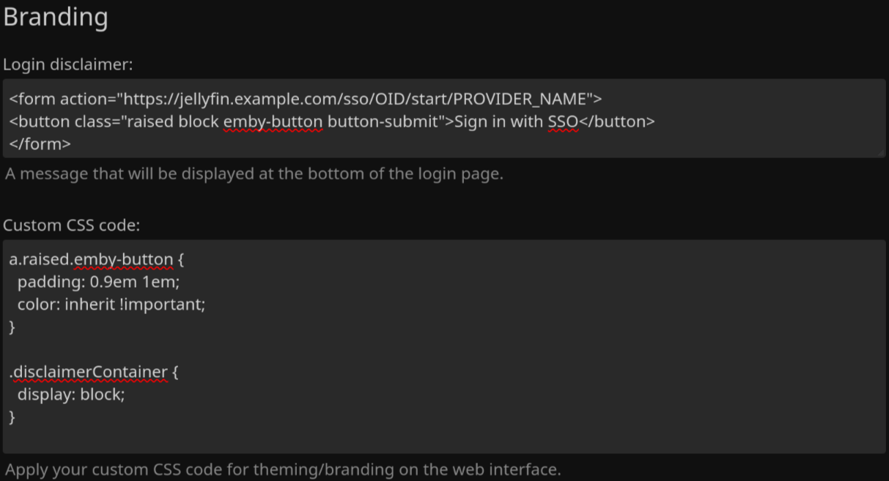

<h1 align="center">Jellyfin SSO Plugin</h1>

<p align="center">


<br/>
<br/>
<a href="https://github.com/9p4/jellyfin-plugin-sso">

</a>
<a href="https://github.com/9p4/jellyfin-plugin-sso/actions/workflows/dotnet.yml">

</a>
<a href="https://github.com/9p4/jellyfin-plugin-sso/releases">

</a>
<a href="https://github.com/9p4/jellyfin-plugin-sso/releases.atom">

</a>
<a href="https://github.com/9p4/jellyfin-plugin-sso/commits/main.atom">

</a>
</p>

This plugin allows users to sign in through an SSO provider (such as Google, Microsoft, or your own provider). This enables one-click signin.

https://user-images.githubusercontent.com/17993169/149681516-f93b43f5-fa5c-4c1f-a909-e5414878a864.mp4

Existing users may link new SSO accounts, or remove existing links using self-service at `/SSOViews/linking`.

## Current State:

This is 100% alpha software! PRs are welcome to improve the code.

~~There is NO admin configuration! You must use the API to configure the program!~~ Added by [strazto](https://github.com/strazto) in PR [#18](https://github.com/9p4/jellyfin-plugin-sso/pull/18) and [#27](https://github.com/9p4/jellyfin-plugin-sso/pull/27).

**[This is for Jellyfin 10.8](https://github.com/9p4/jellyfin-plugin-sso/issues/3) and only on the Web UI and clients supporting [Quick Connect](https://jellyfin.org/docs/general/server/quick-connect)**

**This README reflects the branch it is currently on! Switch tags to view version-specific documentation!**

## Tested Providers

[Find provider specific documentation in providers.md](providers.md)

- Authelia
- authentik
- Keycloak
  - OIDC & SAML
- Google OpenID: Works, but usernames are all numeric

## Supported Protocols

- [OpenID](https://openid.net/what-is-openid/)
- [SAML](https://www.cloudflare.com/learning/access-management/what-is-saml/)

## Security

This is my first time writing C# so please take all of the code written here with a grain of salt. This program should be reasonably secure since it validates all information passed from the client with either a certificate or a secret internal state.

## Installing

Add the package repo [https://raw.githubusercontent.com/9p4/jellyfin-plugin-sso/manifest-release/manifest.json](https://raw.githubusercontent.com/9p4/jellyfin-plugin-sso/manifest-release/manifest.json) to your Jellyfin plugin repositories.

Then, install the plugin from the plugin catalog!

See [Contributing](#contributing) for instructions on how to build from source.

### (Fallback) Legacy package repo (Versions <= 3.3.0)

We have transitioned to a release system that automates distribution, packaging & hosting.
This system is new, and if something goes wrong, you can try using the old package repository as a fallback.

Instead add the **old** package repository: [https://repo.ersei.net/jellyfin/manifest.json](https://repo.ersei.net/jellyfin/manifest.json) to your jellyfin plugin repositories.

### Installing cutting edge/nightly builds

If you're impatient/brave/feel like helping us test things out, you can install the nightly build of the plugin, which is automatically built against the main branch.

The nightly build can be installed from the [main plugin repo](https://raw.githubusercontent.com/9p4/jellyfin-plugin-sso/manifest-release/manifest.json), and will always have a version number of `0.0.0.9000`.

The nightly build may have new features unavailable in other builds, but **be warned**, things may change frequently in nightly builds, and things may break, and you could lose data.

## Roadmap

- [x] Admin page
- [ ] Automated tests
- [x] Add role/claims support
- [x] Use canonical usernames instead of preferred usernames
- [x] Add user self-service
- [ ] Finalize RBAC access for all user properties

## Examples

**Note that you should add both "/r/" and "/redirect/" paths to your SSO provider's configuration!**

### Creating A Login Button On The Main Page

In the Jellyfin administration UI, under "General", there is a "Branding" section. In that section, add the following code in the "Login disclaimer" block (replacing `PROVIDER_NAME` and the domain):

```html
<form action="https://jellyfin.example.com/sso/OID/start/PROVIDER_NAME">
  <button class="raised block emby-button button-submit">
    Sign in with SSO
  </button>
</form>
```

Then, add the following code in the "Custom CSS code" section:

```css
a.raised.emby-button {
  padding: 0.9em 1em;
  color: inherit !important;
}

.disclaimerContainer {
  display: block;
}
```



For more information, refer to [issue #16](https://github.com/9p4/jellyfin-plugin-sso/issues/16).

### SAML

Example for adding a SAML configuration with the API using [curl](https://curl.se/):

`curl -v -X POST -H "Content-Type: application/json" -d '{"samlEndpoint": "https://keycloak.example.com/realms/test/protocol/saml", "samlClientId": "jellyfin-saml", "samlCertificate": "Very long base64 encoded string here", "enabled": true, "enableAuthorization": true, "enableAllFolders": false, "enabledFolders": [], "adminRoles": ["jellyfin-admin"], "roles": ["allowed-to-use-jellyfin"], "enableFolderRoles": true, "folderRoleMapping": [{"role": "allowed-to-watch-movies", "folders": ["cc7df17e2f3509a4b5fc1d1ff0a6c4d0", "f137a2dd21bbc1b99aa5c0f6bf02a805"]}]}' "https://myjellyfin.example.com/sso/SAML/Add/PROVIDER_NAME?api_key=API_KEY_HERE"`

Make sure that the JSON is the same as the configuration you would like.

The SAML provider must have the following configuration (I am using Keycloak, and I cannot speak for whatever you will see):

- Sign Documents on
- Sign Assertions off
- Client Signature Required off
- Redirect URI: [https://myjellyfin.example.com/sso/SAML/post/PROVIDER_NAME](https://myjellyfin.example.com/sso/SAML/start/PROVIDER_NAME)
- Base URL: [https://myjellyfin.example.com](https://myjellyfin.example.com)
- Master SAML processing URL: [https://myjellyfin.example.com/sso/SAML/start/PROVIDER_NAME](https://myjellyfin.example.com/sso/SAML/start/PROVIDER_NAME)

Make sure that `clientid` is replaced with the actual client ID and `PROVIDER_NAME` is replaced with the chosen provider name!

### OpenID

Example for adding an OpenID configuration with the API using [curl](https://curl.se/)

`curl -v -X POST -H "Content-Type: application/json" -d '{"oidEndpoint": "https://keycloak.example.com/realms/test", "oidClientId": "jellyfin-oid", "oidSecret": "short secret here", "enabled": true, "enableAuthorization": true, "enableAllFolders": false, "enabledFolders": [], "adminRoles": ["jellyfin-admin"], "roles": ["allowed-to-use-jellyfin"], "enableFolderRoles": true, "folderRoleMapping": [{"role": "allowed-to-watch-movies", "folders": ["cc7df17e2f3509a4b5fc1d1ff0a6c4d0", "f137a2dd21bbc1b99aa5c0f6bf02a805"]}], "roleClaim": "realm_access", "oidScopes" : [""]}' "https://myjellyfin.example.com/sso/OID/Add/PROVIDER_NAME?api_key=API_KEY_HERE"`

The OpenID provider must have the following configuration (again, I am using Keycloak)

- Access Type: Confidential
- Standard Flow Enabled
- Redirect URI: [https://myjellyfin.example.com/sso/OID/redirect/PROVIDER_NAME](https://myjellyfin.example.com/sso/OID/redirect/PROVIDER_NAME)
- Base URL: [https://myjellyfin.example.com](https://myjellyfin.example.com)

Make sure that `clientid` is replaced with the actual client ID and `PROVIDER_NAME` is replaced with the chosen provider name!

## API Endpoints

The API is all done from a base URL of `/sso/`

### SAML

#### Flow

- POST `SAML/start/PROVIDER_NAME`: This is the SAML POST endpoint. It accepts a form response from the SAML provider and returns HTML and JavaScript for the client to login with a given provider name.
- GET `SAML/start/PROVIDER_NAME`: This is the SAML initiator: it will begin the authorization flow for SAML with a given provider name.
- POST `SAML/Auth/PROVIDER_NAME`: This is the SAML client-side API: the HTML and JavaScript client will call this endpoint to receive Jellyfin credentials given a provider name. Post format is in JSON with the following keys:
  - `deviceId`: string. Device ID.
  - `deviceName`: string. Device name.
  - `appName`: string. App name.
  - `appVersion`: string. App version.
  - `data`: string. The signed SAML XML request. Used to verify a request.

#### Configuration

These all require authorization. Append an API key to the end of the request: `curl "http://myjellyfin.example.com/sso/SAML/Get?api_key=API_KEY_HERE"`

- POST `SAML/Add/PROVIDER_NAME`: This adds or overwrites a configuration for SAML for the given provider name. It accepts JSON with the following keys and format:
  - `samlEndpoint`: string. The SAML endpoint.
  - `samlClientId`: string. The SAML client ID.
  - `samlCertificate`: string. The base64 encoded SAML certificate.
  - `enabled`: boolean. Determines if the provider is enabled or not.
  - `enableAuthorization`: boolean: Determines if the plugin sets permissions for the user. If false, the user will start with no permissions and an administrator will add permissions. If disabled, then the permissions of users will not be modified and the Jellyfin defaults will be used instead.
  - `enableAllFolders`: boolean. Determines if the client logging in is allowed access to all folders.
  - `enabledFolders`: array of strings. If `enableAllFolders` is set to false, then this will be used to determine what folders the users who log in through this provider are allowed to use.
  - `roles`: array of strings. This validates the SAML response against the `Role` attribute. If a user has any of these roles, then the user is authenticated. Leave blank to disable role checking.
  - `adminRoles`: array of strings. This uses SAML response's `Role` attributes. If a user has any of these roles, then the user is an admin. Leave blank to disable (default is to not enable admin permissions).
  - `enableFolderRoles`: boolean. Determines if role-based folder access should be used.
  - `folderRoleMapping`: object in the format "role": string and "folders": array of strings. The user with this role will have access to the following folders if `enableFolderRoles` is enabled. To get the IDs of the folders, GET the `/Library/MediaFolders` URL with an API key. Look for the `Id` attribute.
  - `enableLiveTvRoles`: boolean. Determines if role-based Live TV access should be used.
  - `liveTvRoles`: array of strings. If `enableLiveTvRoles` is enabled, then the user's roles will be checked against these. If the user is granted permission, then the user will be able to view Live TV.
  - `liveTvManagementRoles`: array of strings. If `enableLiveTvRoles` is enabled, then the user's roles will be checked against these. If the user is granted permission, then the user will be able to manage Live TV.
  - `enableLiveTv`: boolean. Whether to allow Live TV by default. This applies even if `enableLiveTvRoles` is enabled.
  - `enableLiveTvManagement`: boolean. Whether to allow Live TV management by default. This applies even if `enableLiveTvRoles` is enabled.
  - `defaultProvider`: string. The set provider then gets assigned to the user after they have logged in. If it is not set, nothing is changed. With this, a user can login with SSO but is still able to log in via other providers later. See the `Unregister` endpoint.
  - `schemeOverride`: string. Sets the scheme for URLs used. Can be useful if the plugin refuses to use HTTPS URLs.
- GET `SAML/Del/PROVIDER_NAME`: This removes a configuration for SAML for a given provider name.
- GET `SAML/Get`: Lists the configurations currently available.

### OpenID

#### Flow

- GET `OID/redirect/PROVIDER_NAME`: This is the OpenID callback path. This will return HTML and JavaScript for the client to login with a given provider name.
- GET `OID/start/PROVIDER_NAME`: This is the OpenID initiator: it will begin the authorization flow for OpenID with a given provider name.
- POST `OID/Auth/PROVIDER_NAME`: This is the OpenID client-side API: the HTML and JavaScript client will call this endpoint to receive Jellyfin credentials for a given provider name. Post format is in JSON with the following keys:
  - `deviceId`: string. Device ID.
  - `deviceName`: string. Device name.
  - `appName`: string. App name.
  - `appVersion`: string. App version.
  - `data`: string. The OpenID state. Used to verify a request.

#### Configuration

These all require authorization. Append an API key to the end of the request: `curl "http://myjellyfin.example.com/sso/OID/Get?api_key=9c6e5fae4ae145669e6b7a3942f813b7"`

- POST `OID/Add/PROVIDERNAME`: This adds or overwrites a configuration for OpenID with a given provider name. It accepts JSON with the following keys and format:
  - `oidEndpoint`: string. The OpenID endpoint. Must have a `.well-known` path available.
  - `oidClientId`: string. The OpenID client ID.
  - `oidSecret`: string. The OpenID secret.
  - `enabled`: boolean. Determines if the provider is enabled or not.
  - `enableAuthorization`: boolean: Determines if the plugin sets permissions for the user. If false, the user will start with no permissions and an administrator will add permissions. If disabled, then the permissions of users will not be modified and the Jellyfin defaults will be used instead.
  - `enableAllFolders`: boolean. Determines if the client logging in is allowed access to all folders.
  - `enabledFolders`: array of strings. If `enableAllFolders` is set to false, then this will be used to determine what folders the users who log in through this provider are allowed to use.
  - `roles`: array of strings. This validates the OpenID response against the claim set in `roleClaim`. If a user has any of these roles, then the user is authenticated. Leave blank to disable role checking. This currently only works for Keycloak (to my knowledge).
  - `adminRoles`: array of strings. This uses the OpenID response against the claim set in `roleClaim`. If a user has any of these roles, then the user is an admin. Leave blank to disable (default is to not enable admin permissions).
  - `enableFolderRoles`: boolean. Determines if role-based folder access should be used.
  - `folderRoleMapping`: object in the format "role": string and "folders": array of strings. The user with this role will have access to the following folders if `enableFolderRoles` is enabled. To get the IDs of the folders, GET the `/Library/MediaFolders` URL with an API key. Look for the `Id` attribute.
  - `enableLiveTvRoles`: boolean. Determines if role-based Live TV access should be used.
  - `liveTvRoles`: array of strings. If `enableLiveTvRoles` is enabled, then the user's roles will be checked against these. If the user is granted permission, then the user will be able to view Live TV.
  - `liveTvManagementRoles`: array of strings. If `enableLiveTvRoles` is enabled, then the user's roles will be checked against these. If the user is granted permission, then the user will be able to manage Live TV.
  - `enableLiveTv`: boolean. Whether to allow Live TV by default. This applies even if `enableLiveTvRoles` is enabled.
  - `enableLiveTvManagement`: boolean. Whether to allow Live TV management by default. This applies even if `enableLiveTvRoles` is enabled.
  - `roleClaim`: string. This is the value in the OpenID response to check for roles. For Keycloak, it is `realm_access.roles` by default. The first element is the claim type, the subsequent values are to parse the JSON of the claim value. Use a "\\." to denote a literal ".". This expects a list of strings from the OIDC server.
  - `oidScopes` : array of strings. Each contains an additional scope name to include in the OIDC request.
    - For some OIDC providers (For example, [authelia](https://github.com/9p4/jellyfin-plugin-sso/issues/23#issuecomment-1112237616)), additional scopes may be required in order to validate group membership in role claim.
    - Leave empty to only request the default scopes.
  - `defaultProvider`: string. The set provider then gets assigned to the user after they have logged in. If it is not set, nothing is changed. With this, a user can login with SSO but is still able to log in via other providers later. See the `Unregister` endpoint.
  - `defaultUsernameClaim`: string. The provider will use the claim to create the users' usernames. If not set, it fallbacks to `preferred_username`.
  - `avatarUrlFormat`: string. The URL format for the users avatars. OIDC claims can be used by using the `@{claim_type}` syntax. If not set, the avatars won't change. 
  - `disableHttps`: boolean. Determines whether the OpenID discovery endpoint requires HTTPS.
  - `doNotValidateEndpoints`: boolean. Determines whether the OpenID discovery process will validate endpoints. This may be required for Google.
  - `doNotValidateIssuerName`: boolean. Determines whether the OpenID discovery process will validate the OpenID issuer name.
  - `schemeOverride`: string. Sets the scheme for URLs used. Can be useful if the plugin refuses to use HTTPS URLs.
- GET `OID/Del/PROVIDER_NAME`: This removes a configuration for OpenID for a given provider name.
- GET `OID/Get`: Lists the configurations currently available.
- GET `OID/States`: Lists currently active OpenID flows in progress.

### Misc

- POST `Unregister/username`: This "unregisters" a user from SSO. A JSON-formatted string must be posted with the new authentication provider. To reset to the default provider, use `Jellyfin.Server.Implementations.Users.DefaultAuthenticationProvider` like so: `curl -X POST -H "Content-Type: application/json" -d '"Jellyfin.Server.Implementations.Users.DefaultAuthenticationProvider"' "https://myjellyfin.example.com/sso/Unregister/username?api_key=API_KEY`

## Limitations

Logging in with an SSO account that has the same username as an existing Jellyfin account will override the permissions for the user. Use caution when overriding the administrator account!

~~There is no GUI to sign in. You have to make it yourself! The buttons should redirect to something like this: [https://myjellyfin.example.com/sso/SAML/start/clientid](https://myjellyfin.example.com/sso/SAML/start/clientid) replacing `clientid` with the provider client ID and `SAML` with the auth scheme (either `SAML` or `OID`).~~

~~Furthermore, there is no functional admin page (yet). PRs for this are welcome. In the meantime, you have to interact with the API to add or remove configurations.~~ Added by [strazto](https://github.com/strazto) in PR [#18](https://github.com/9p4/jellyfin-plugin-sso/pull/18) and [#27](https://github.com/9p4/jellyfin-plugin-sso/pull/27).

There is also no logout callback. Logging out of Jellyfin will log you out of Jellyfin only, instead of the SSO provider as well.

~~This only supports Jellyfin on its own domain (for now). This is because I'm using string concatenation for generating some URLs. A PR is welcome to patch this.~~ Fixed in [PR #1](https://github.com/9p4/jellyfin-plugin-sso/pull/1).

**This only works on the web UI**. ~~The user must open the Jellyfin web UI BEFORE using the SSO program to populate some values in the localStorage.~~ Fixed by implementing a comment by [Pfuenzle](https://github.com/Pfuenzle) in [Issue #5](https://github.com/9p4/jellyfin-plugin-sso/issues/5#issuecomment-1041864820).

# Contributing

## Dependencies

This project uses Nix flakes to manage development dependencies. Run `nix develop` to use the same toolchain versions.

## Building

This is built with .NET 6.0. Build with `dotnet publish .` for the debug release in the `SSO-Auth` directory. Copy over the `IdentityModel.OidcClient.dll`, the `IdentityModel.dll` and the `SSO-Auth.dll` files in the `/bin/Debug/net6.0/publish` directory to a new folder in your Jellyfin configuration: `config/plugins/sso`.

### VSCode Workflow

An example `.vscode` configuration may be found at [strazto/jellyfin-plugin-sso-vscode](https://github.com/strazto/jellyfin-plugin-sso-vscode).

From the root of this repo, you may clone that to `.vscode`

```bash
# From repo root

git clone https://github.com/strazto/jellyfin-plugin-sso-vscode .vscode
```

## Releasing

This plugin uses [JPRM](https://github.com/oddstr13/jellyfin-plugin-repository-manager) to build the plugin. Refer to the documentation there to install JPRM.

Build the zipped plugin with `jprm --verbosity=debug plugin build .`.

### CI Releases

Anything merged to the main branch will be built and published by our CI system.

Anything tagged/released as a formal Github release will also be built and published by our CI system.

If you wish to use releases from your own fork, refer to
[Installing](#installing), however, you will need to change the url to the
manifest file, `https://raw.githubusercontent.com/9p4/jellyfin-plugin-sso/manifest-release/manifest.json`
so that it refers to your fork.

## Credits and Thanks

Much thanks to the [Jellyfin LDAP plugin](https://github.com/jellyfin/jellyfin-plugin-ldapauth) for offering a base for me to start on my plugin.

I use the [AspNet SAML](https://github.com/jitbit/AspNetSaml/) library for the SAML side of things (patched to work with Base64 on non-Windows machines).

I use the [IdentityModel OIDC Client](https://github.com/IdentityModel/IdentityModel.OidcClient/) library for the OpenID side of things.

Thanks to these projects, without which I would have been pulling my hair out implementing these protocols from scratch.

## Something funny about the origins of this plugin

It totally slipped my mind, but I had [requested this functionality a few years back](https://github.com/jellyfin/jellyfin/issues/2012). What goes around comes around, I guess.
