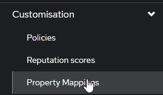
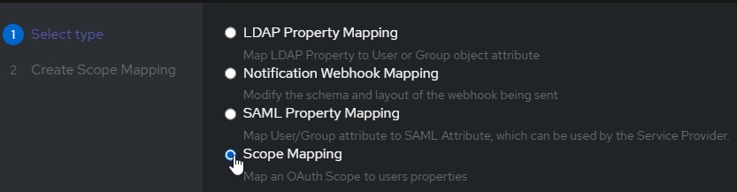
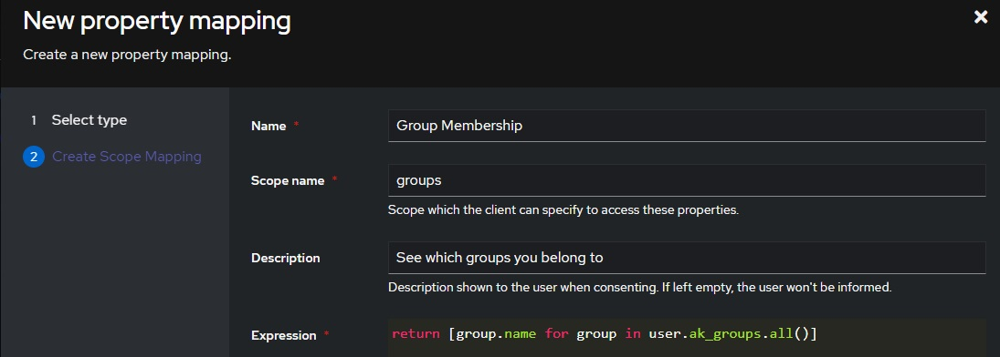
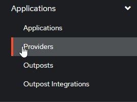
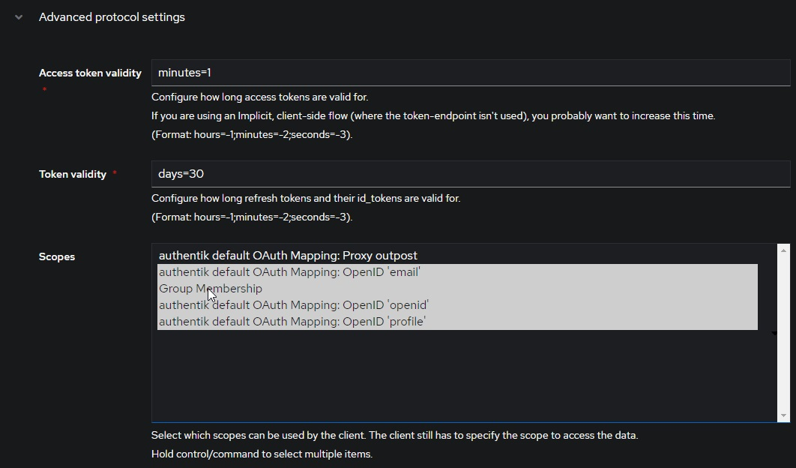

# Provider Specific Configuration

This plugin has been tested to work against various providers, though not all providers provide support for all of this plugins' features.

## TOC / Tested Providers:

This section is broken into providers that support Role-Based Access Control (RBAC), and those that do not

### Providers that support RBAC

- ✅ [Authelia](#authelia)
- ✅ [authentik](#authentik)
- ✅ [Keycloak](#keycloak-oidc)
  - Both [OIDC](#keycloak-oidc) & [SAML](#keycloak-saml)
- 🟩 [Microsoft Entra](#microsoft-entra)
  - ❗ Requires disabling validating OpenID endpoints
- ✅ [Pocket ID](#pocket-id)

### No RBAC Support

- ✅ Google OIDC
  - ❗ Usernames are numeric
  - ❗ Requires disabling validating OpenID endpoints

## General Options, when RBAC is supported

For any provider that supports RBAC, we can configure it as we see fit:

```yaml
Enabled: true
EnableAuthorization: true
EnableAllFolders: true
EnabledFolders: []
Roles: ["jellyfin_user"]
AdminRoles: ["jellyfin_admin"]
EnableFolderRoles: false
FolderRoleMapping: []
```

## Authelia

Authelia is simple to configure, and RBAC is straightforward.

### Authelia's Config

Below is the `identity_providers` section of an Authelia config:

### Authelia v4.38 and above

```yaml
identity_providers:
  oidc:
    # hmac secret and private key given by env variables
    clients:
      - client_id: jellyfin
        client_name: My media server
        # Client secret should be randomly generated
        client_secret: <redacted>
        token_endpoint_auth_method: client_secret_post
        authorization_policy: one_factor
        redirect_uris:
          - https://jellyfin.example.com/sso/OID/redirect/authelia
```

### Authelia v4.37 and below

```yaml
identity_providers:
  oidc:
    # hmac secret and private key given by env variables
    clients:
      - id: jellyfin
        description: My media server
        # Client secret should be randomly generated
        secret: <redacted>
        authorization_policy: one_factor
        redirect_uris:
          - https://jellyfin.example.com/sso/OID/redirect/authelia
```

### Jellyfin's Config

On Jellyfin's end, we need to configure an Authelia provider as follows:

In order to test group membership, we need to request Authelia's `groups` OIDC scope, which we will use to check user roles.

```yaml
authelia:
  OidEndpoint: https://authelia.example.com
  OidClientId: jellyfin
  OidSecret: <redacted>
  RoleClaim: groups
  OidScopes: ["groups"]
  DisablePushedAuthorization: true
```

## authentik

To begin with, we must set up an OIDC provider + application in authentik. Refer to the official documentation for detailed instruction.

### authentik's Config

authentik supports RBAC, but is slightly more complicated to configure than Authelia, as we need to configure a custom scope binding to include in the OIDC response.

To do this, we:

- create a **Custom Property Mapping**

  

- Create a **Scope Mapping**

  

- Assign the following attributes:

  

  ```yaml
  # A nice, human readable name
  name: Group Membership
  # The name of the scope a client must request to get access to a user's groups
  Scope Name: groups
  # A description of what is being requested to show to a user
  Description: See Which Groups you belong to
  ```

- For the **Expression** field, use the following code:
  ```python
  return [group.name for group in user.ak_groups.all()]
  ```

Now we can add this property mapping to authentik's Jellyfin OAuth provider:

- Navigate to `Applications/providers`

  

- Edit / Update your Jellyfin OAuth provider
- Verify your **"Redirect URIs/Origins (RegEx)"** follows the format: `https://domain.tld/sso/OID/redirect/Authentik`.
- Under **"Advanced Protocol Settings"**, add the **Group Membership** Scope

  

### Jellyfin's Config

On Jellyfin's end, we need to configure an authentik provider as follows:

In order to test group membership, we need to request authentik's OIDC scope `groups`, which we will use to check user roles.

```yaml
authentik:
  OidEndpoint: https://authentik.example.com/application/o/jellyfin
  OidClientId: <same-as-in-authentik>
  OidSecret: <redacted>
  RoleClaim: groups
  OidScopes: ["groups"]
```

If you recieve the error `Error processing request.` from Jellyfin when attempting to login and the Jellyfin logs show `Error loading discovery document: Endpoint belongs to different authority` try setting `Do not validate endpoints` in the plugin settings.

## Keycloak OIDC

Keycloak in general is a little more complicated than other providers. Ensure that you have a realm created and have some usable users.

### Keycloak's Config

Create a new Keycloak `openid-connect` application. Set the root URL to your Jellyfin URL (ie https://myjellyfin.example.com)

Ensure that the following configuration options are set:

- Access Type: Confidential
- Standard Flow Enabled
- Redirect URI: https://myjellyfin.example.com/sso/OID/redirect/PROVIDER_NAME
- Redirect URI (for Android app): org.jellyfin.mobile://login-callback
- Base URL: https://myjellyfin.example.com

Press the "Save" button at the bottom of the page and open the "Credentials" tab. Note down the secret.

For adding groups and RBAC, go to the "mappers" tab, press "Add Builtin", and select either "Groups", "Realm Roles", or "Client Roles", depending on the role system you are planning on using. Once the mapper is added, edit the mapper and ensure that you note down the Token Claim Name as well as enable all four toggles: "Multivalued", "Add to ID token", "Add to access token", and "Add to userinfo" are enabled.

Note that if you are using the template for the "Client Roles" mapper, the default token claim name has `${client_id}` in it. When noting down this value, make sure you note down the actual Client ID (which should be written above).

### Jellyfin's Config

On Jellyfin's side, we need to configure a Keycloak provider as follows:

```yaml
keycloak:
  OidEndpoint: https://keycloak.example.com/realms/<realm>
  OidClientId: <same-as-in-keycloak>
  OidSecret: <redacted>
  RoleClaim: <same-as-token-claim-name>
```

## Microsoft Entra

Entra ID setup is pretty standard and straightforward. It is (almost) fully compatible with the plugin, but requires a few additional configuration steps due to Microsoft's endpoint structure.

### 1️⃣ Create an Application
Go to *Entra Admin Center > App registrations > New Registration* to create a new application for Jellyfin SSO. Based on your situation select the appropriate *Supported account types*. 

For *Redirect URI*, select *Web* and input `https://<jellyfin-url>/sso/OID/redirect/<plugin-configuration-name>`. **(⚠️ Case Sensitive)**

### 2️⃣ Grant Directory Permissions
Go to *(Your App Registration) > API permissions > Add a permission > Microsoft Graph > Application permissions*, add:
- Directory.Read.All
- GroupMember.Read.All (Optional for RBAC)

**then click *grant admin consent*.**

### 3️⃣ Group Claims
RBAC can be based on one or more of the following group types:
- Security groups
- Directory roles
- All groups (includes 3 group types)
- Groups assigned to the application

The `Object ID` of the group will be used for `roles`, however, Entra ID does not send this by default.

Go to *(Your App Registrationn) > Token configuration > Add groups claim*, select the group type(s) that would fit your situation. Leave *Customize token properties by type* as default, and click *Save*.

### 4️⃣ Plugin Configurations
Collect these information from the admin center:
- `Application (client) ID` -> `tenant-id`
- `Directory (tenant) ID` -> `client-id`
- `Client secret` (use `Value`) -> `client-secret`
- Group's `Object ID` (for RBAC) -> `object-id`

#### Sample Configuration

```yaml
entraID:
  OidEndpoint: "https://login.microsoftonline.com/<tenant-id>/v2.0/.well-known/openid-configuration"
  OidClientId: "<client-id>"
  OidSecret: "<client-secret>"
  AdminRoles: ["<object-id>"]
  Roles: ["<object-id>"]
  RoleClaim: "groups"
  OidScopes: [] # Leave blank to use "preferred_username" which is the user's UPN.
  DoNotValidateEndpoints: true # ⚠️ Important: See Note.

```

### ⚠️ DoNotValidateEndpoints
**This is required to be set to `true`.**

Microsoft uses `https://login.microsoftonline.com/<tenant-id>/v2.0"` for `issuer` while using `https://graph.microsoft.com/oidc/userinfo` for `user_info_endpoint`. (check your well-known configuration)

If this is not `true`, the plugin throws `System.InvalidOperationException: Error loading discovery document: Endpoint is on a different host than authority`.

### ℹ️ Avatars
The user's avatar can be retreieved through `https://graph.microsoft.com/v1.0/me/photo/$value`. However, this endpoint requires an auenticated requesting including a valid Graph access token (with User.Read permissions). The plugin cannot fetch this URL directly because it does not come with that feature. A possible workaround is to host avatars with a public URL and include a custom claim with that URL.

## Keycloak SAML

Keycloak with SAML is very similar to OpenID. Again, Keycloak in general is a little more complicated than other providers. Ensure that you have a realm created and have some usable users.

### Keycloak's Config

Create a new Keycloak `saml` application. Set the root URL to your Jellyfin URL (ie https://myjellyfin.example.com)

Ensure that the following configuration options are set:

- Sign Documents on
- Sign Assertions off
- Client Signature Required off
- Redirect URI: [https://myjellyfin.example.com/sso/SAML/start/PROVIDER_NAME](https://myjellyfin.example.com/sso/SAML/start/PROVIDER_NAME)
- Base URL: [https://myjellyfin.example.com](https://myjellyfin.example.com)
- Master SAML processing URL: [https://myjellyfin.example.com/sso/SAML/start/PROVIDER_NAME](https://myjellyfin.example.com/sso/SAML/start/PROVIDER_NAME)

Press the "Save" button at the bottom of the page.

For adding groups and RBAC, go to the "mappers" tab, press "Add Builtin", and select either "Groups", "Realm Roles", or "Client Roles", depending on the role system you are planning on using. Once the mapper is added, edit the mapper and ensure that you note down the Token Claim Name as well as enable all four toggles: "Multivalued", "Add to ID token", "Add to access token", and "Add to userinfo" are enabled.

Note that if you are using the template for the "Client Roles" mapper, the default token claim name has `${client_id}` in it. When noting down this value, make sure you note down the actual Client ID (which should be written above).

Finally, download the certificate. Open the "Installation" tab, select "Mod Auth Mellon files", and download the zip. Extract the zip file, and open the `idp-metadata.xml` file. Note down the contents of the `X509Certificate` value.

### Jellyfin's Config

```yaml
keycloak:
  SamlEndpoint: https://keycloak.example.com/realms/<realm>/protocol/saml
  SamlClientId: <same-as-in-keycloak>
  SamlCertificate: <copied-from-xml-file>
```

## Pocket ID
A simple and easy-to-use OIDC provider that allows users to authenticate with their passkeys to your services.

### Pocket ID Config
1. Login to you Pocket ID admin account
1. Go to `Administration -> OCID Clients`
1. Click `Add OCID Client`
1. Give the client a name e.g. `Jellyfin`
1. Set the `Clent Launch URL` to your Jellyfin endpoint
1. Set the callbak url to `https://jellyfin.example.com/sso/OID/redirect/pocketid`. The `pocketid` part must match the `Name of OpenID Provider` in the Jellyfin SSO provider
1. (optional) Enable PKCE if Jellyfin is an https endpoint
1. (optional) Set a logo
1. (optional) Set `Allowed User Groups`

### Jellyfin's Config
```yaml
pocketid:
  OidEndpoint: https://pocketid.example.com/.well-known/openid-configuration
  OidClientId: <pocket-id-client-id>
  OidSecret: <pocket-id-secret>
  EnableAuthorization: true # (optional) If you want Jellyfin to read group permissions from pocket id
  RoleClaim: groups # (optional) If you want Jellyfin to be able to read group assignments from pocket id
  AdminRoles: admin # (optional) The pocket id group which will give a user Jellyfin admin privilges
  Roles: users  # (optional) The pocket id group which will give a user Jellyfin access
  AvatarUrlFormat: @{picture} # (optional) This will pull each users pocket id photo into Jellyfin
```
